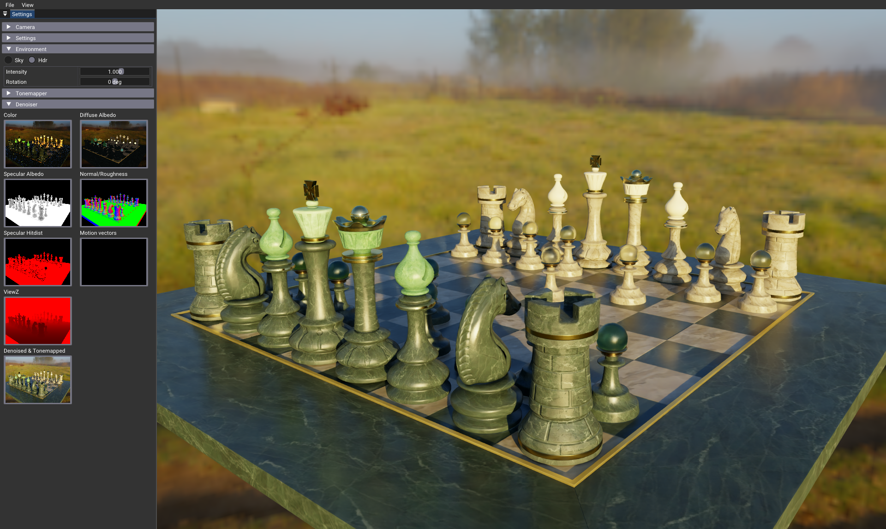

# Integration of DLSS-RR into a Vulkan Application
 


This example demonstrates DLSS-RR ("Deep Learning Super Sampling Ray Reconstruction")
in a simple path tracer rendering a glTF scene. DLSS-RR combines a denoiser, upscaler and
temporal antialiasing all in one package. Simplified, this means: present DLSS-RR with a series
of noisy, jittered low resolution images and it will output a denoised, upscaled and jitter-free image.

## Building 

Follow the general CMake process to configure and build the sample.
Dependencies will be automatically fetched, in particular the  DLSS-RR SDK will be
automatically pulled from [https://github.com/NVIDIA/DLSS](https://github.com/NVIDIA/DLSS)

## CMake integration

`CMakeLists.txt` uses nvpro_core's [`ngx.cmake`]() script to download the DLSS-RR
SDK at configuration time. Since DLSS-RR itself does not offer direct CMake
integration and comes as a "snippet" which plugs into the NGX framework,
`nvpro_core2/ngx.cmake` adds NGX as an imported library to the CMake build.

`dlss_rr/CMakeLists.txt` then copies the DLSS shared libraries to the build and
install directories:

```
list(APPEND CMAKE_MODULE_PATH "${CMAKE_CURRENT_LIST_DIR}/cmake")

# NGX (DLSS) dependency
find_package(NGX REQUIRED)

...

copy_to_runtime_and_install(${PROJECT_NAME}
  FILES ${DLSS_DLLS}
  AUTO
)
```

## Integration of DLSS-RR

DLSS-RR can be used with DirectX and Vulkan. Its API is based on NGX, with DLSS-RR presenting itself as plugin (or
"Snippet" in NGX' terms) to NGX . In this example we'll focus on the Vulkan integration. In contrast to NRD, DLSS-RR
supports Vulkan _directly_ - it can be fed directly with Vulkan image descriptors, it understands how to compile Vulkan
shaders on its own and how to execute the DLSS-RR pipeline through a provided Vulkan command buffer. On top of that, it
doesn't require most of the texture data to be encoded in a particular way and offers some flexibility (for instance it
supports packed or separate normal and roughness textures). This means, there's no need to change one's own shaders
much, especially if one had a denoiser already integrated. Overall, DLSS-RR's approach greatly simplifies the
integration with an existing Vulkan backend.

### DLSS-RR wrapper classes

Included in this sample come two classes "NgxContext" and "DlssRR".
* "NgxContext" is responsible for creating a NGX context, querying the availability 
of the DLSS-RR feature and acting as factory for the DlssRR class.
* DlssRR is used to setup and perform the upscaling-denoising.

With a little over 400 lines of code, it proves that a DLSS-RR integration 
into Vulkan code is really simple.

DlssRR wrapper is making use of the Vulkan specific NGX and DLSS-RR headers

* nvsdk_ngx_vk.h
* nvsdk_ngx_helpers_vk.h
* nvsdk_ngx_helpers_dlssd_vk.h
* nvsdk_ngx_defs_dlssd.h
* nvsdk_ngx_helpers_dlssd.h

Beware: there are some inconsistencies when the SDK and headers refer to DLSS-RR. Sometimes function calls are suffixed
with `_D` to refer to the DLSS-RR functions. The functions without the suffix actually only apply to DLSS, which is the
older supersampling-antialising solution. Sometimes the DLSS-RR feature is also referred to by just "RayReconstruction".

The two wrapper classes don't cover all functionality DLSS-RR can offer (refer to the [*DLSS-RR Integration Guide*](https://github.com/NVIDIA/DLSS/blob/af199869c51cf2d71cc64d3db5064788ff38eb02/doc/DLSS-RR%20Integration%20Guide%20API.pdf) to learn
about additional guide buffers and settings), but are small enough to be quickly adopted and modified for your own needs.
Beware that the DLSS-RR Integration Guide is thought to be addendum to the [*DLSS Programming Guide*](https://github.com/NVIDIA/DLSS/blob/af199869c51cf2d71cc64d3db5064788ff38eb02/doc/DLSS_Programming_Guide_Release.pdf)

Features not covered in this sample
* Providing more optional guide buffers besides the `RESOURCE_SPECULAR_HITDISTANCE`
* Usage of 'hardware depth buffer' depth encoding in NDC coordinates ```math P.z / P.w ```
* multi-GPU support

## DLSS-RR input textures

The DlssRR class takes a number of textures ('resources' in DLSS-RR lingo) to forward to DLSS-RR later on. Here is a
description of what data each resource represents. Refer to the *DLSS-RR Integration Guide* for further information on each
resource.

* `RESOURCE_COLOR_IN`: this texture contains the noisy input image to the denoiser. In this sample, its the output of the pathtracer.
* `RESOURCE_COLOR_OUT`: this is the output texture of the denoiser, upscaled to output size
* `RESOURCE_DIFFUSE_ALBEDO`: this texture contains the diffuse albedo
* `RESOURCE_SPECULAR_ALBEDO`: this texture contains the specular reflectance for the current point of view, integrated over the surface's hemisphere. The DLSS-RR SDK contains a formula for computing an approximation of this term.
* `RESOURCE_NORMALROUGHNESS`: normal and material roughness packed into a 4D vector. The normal vector should be between [-1..1] and roughness is linear.
* `RESOURCE_MOTIONVECTOR`: this texture contains screenspace 2D vectors, pointing from the current pixel position back to "where this pixel was in the last frame"
* `RESOURCE_LINEARDEPTH`: this is the linear depth of the primary hit position in camera space. For example, ```math float z = -(worldToView * hitPosition).z``` yields the desired value.
* `RESOURCE_SPECULAR_HITDISTANCE`: this texture contains the distance from the primary hit surface to the first secondary hit. This is an optional guide buffer; complementary to specular motion vectors. Providing specular motion vectors is superior.

With the exception of `RESOURCE_COLOR_OUT`, all input buffers are presented in the (smaller) render resolution.
`RESOURCE_COLOR_OUT` has the desired output resolution. In addition, the pathtracer will produce jittered primary
samples. DLSS-RR will take care of the upscaling and compensate for the jitter during the denoising process.

## DLSS-RR Tips & Tricks

### Interacting with the sample application

* You can load a different scene or provide a different HDRI environment map by drag'n'drop of a '*.gtlf' or '*.hdr' file.
* Some scenes have broken normal maps (vertically flipped). If thats the case the _Settings/Flip Bitangent_ setting may help
* You can click on the guide buffers and have them shown in the main viewport instead of the normal render output. This is a nice way to see how noisy and relatively small the input signal actually is.
* _DLSS RR/Show Buffers Scaled_ gives an idea about the upscaling in place.
* _DLSS RR/Presets_ and _DLSS RR/Quality_ determine the (AI) model in use and quality setting
* _DLSS RR/Input Width_ and _DLSS RR/Input Height_ lets you play with the size of the input buffers in the range the chosen quality setting allows for

### Depth values

Pass either HW depth buffer _or_ view space (linear) depth. The HW depth range must be in [0, 1] range, while the linear depth is unbounded.
```math 
hw_depth = clip_space.Z / clip_space.W
```
Pass 'NVSDK_NGX_DLSS_Feature_Flags_DepthInverted' flag if smaller values of the passed depth buffer are further away.
Prefer HW depth buffer. This is just for performance, and for matching buffers with DLSS-SR.
Prefer 32 bit depth, but 16 bit can also work albeit might exhibit depth precision issues.

### Matrices

DLSS-RR expects matrices in row-major memory layout. These matrices are expected to be left-multiplied with row vectors:

```math 
\begin{bmatrix} 
x_1 & x_2 & x_3 & x_4
\end{bmatrix}
\begin{bmatrix} 
a_{11} & a_{12} & a_{13} & a_{14} \\
a_{21} & a_{22} & a_{23} & a_{24} \\
a_{31} & a_{32} & a_{33} & a_{34} \\
a_{41} & a_{42} & a_{43} & a_{44}
\end{bmatrix} =
\begin{bmatrix}
x_1' & x_2' & x_3' & x_4'
\end{bmatrix}
````

Contrast this with GLM's column-major, right-multiply matrices:

```math
\begin{bmatrix} 
a_{11} & a_{12} & a_{13} & a_{14} \\
a_{21} & a_{22} & a_{23} & a_{24} \\
a_{31} & a_{32} & a_{33} & a_{34} \\
a_{41} & a_{42} & a_{43} & a_{44}
\end{bmatrix} 
\begin{bmatrix} 
x_1 \\
x_2 \\
x_3 \\
x_4
\end{bmatrix}
=
\begin{bmatrix}
x_1' \\
x_2' \\
x_3' \\
x_4'
\end{bmatrix}
```

As it happens to be, the required transpose operations to convert from one to the other results in identity; thus the sample passes the GLM matrices straight into DLSS-RR.

### Sky

For the sky to not show trailing artifacts, you _must_ provide motion vectors for the sky (in particular covering the
camera's rotation). In this sample, we simply project the view vector as "point on sky projected to infinity" back into
the previous frame to obtain motion vectors for the sky. In addition, we bake a tonemapped color value for the sky
into the diffuse albedo buffer to keep the denoiser from removing desired detail in the sky.

### Mirror-like surfaces

Mirror-like surfaces work better with a special treatment. Instead of recording the position and hit parameters at the
surface of the mirror, we continue following the mirrored ray until it hits something that is not a mirror - the
_Primary Surface Replacement (PSR)_. It looks like as if we can see the mirrored objects appear "behind" the mirror as
though the mirror acts as kind of a portal into a virtual world. The G-Buffer records the data of the PSR at its
virtual world space, such as Normal, Roughness and ViewZ. This improves denoising reflected objects.

Look into `shaders/primary_rgen.slang` for `#PSR` to find the shader code that implements
primary surface replacement.

### MIS weighting

The implemented path tracer uses the Monte Carlo method with importance sampling to estimate the integral in the [rendering
equation](https://en.wikipedia.org/wiki/Rendering_equation). Care has to be taken when the path tracer samples the same
function multiple times, but uses different PDFs when doing so. This sample is built such that, at the primary hit and
each segment of the indirect path, we sample the environment map for its direct light contribution at that point. It
then follows the material's BSDF to probe for indirect lighting contribution at the hit point. Thus, for any surface
point along the path it can happen that the environment is sampled twice: once via directly probing the environment map
(the envmap has its own precomputed sampling distribution) and once more when following the material's BSDF at each hit
point. Both contributions need to be weighted accordingly. In this sample we chose the "power heuristic" to compute the
MIS weights for both contributions.


## Authors and Metadata

Tags:

- raytracing, path-tracing, GLTF, HDR, tonemapper, picking, BLAS, TLAS, PBR material, denoising, DLSS-RR, Slang

Extensions:

- VK_KHR_buffer_device_address, VK_KHR_acceleration_structure,VK_KHR_ray_tracing_pipeline, 
VK_KHR_ray_query, VK_KHR_push_descriptor, VK_KHR_shader_clock, VK_KHR_create_renderpass2

Authors:
- Mathias Heyer
